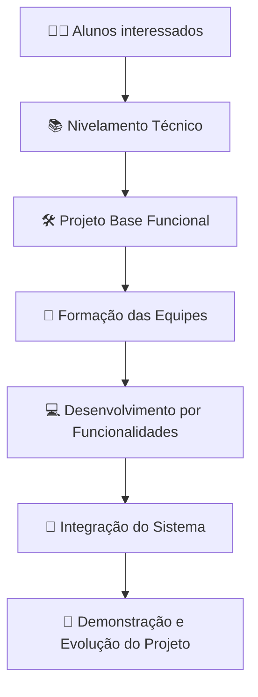
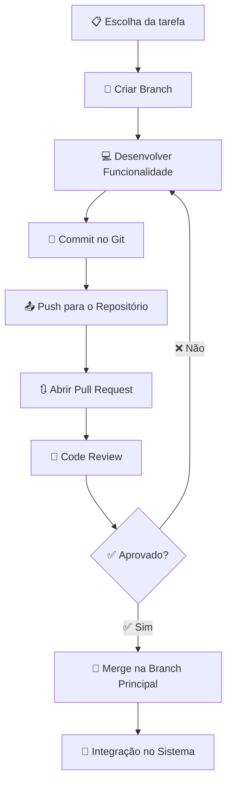

# 🏭 Software Factory Lab - Laboratório Independente de Desenvolvimento de Software

## 📋 1. Apresentação

Este laboratório tem como objetivo proporcionar aos alunos uma experiência prática de desenvolvimento de software em ambiente colaborativo, simulando processos e práticas adotadas no mercado de tecnologia.

A proposta é reunir estudantes interessados em desenvolvimento de software para aprender, praticar e construir sistemas reais em equipe, utilizando ferramentas e metodologias profissionais.

### 🎯 Foco do laboratório:

- ✅ Aprender engenharia de software na prática
- ✅ Desenvolver sistemas reais
- ✅ Trabalhar em equipe
- ✅ Construir portfólio técnico
- ✅ Preparar os participantes para o mercado de tecnologia

---

## 🔄 Visão Geral do Funcionamento do Laboratório



---

## 📜 2. Natureza da Iniciativa

A participação neste laboratório possui caráter **voluntário e independente**.

### ⚠️ É importante destacar que:

- 🤝 A participação é **totalmente voluntária**
- 🏫 Não existe vínculo institucional formal com a instituição de ensino
- 👨‍🏫 A atividade é conduzida de forma independente por um professor interessado em promover aprendizado prático
- 💰 Não há remuneração para o professor responsável ou para os participantes
- 📖 A iniciativa tem caráter **educacional e colaborativo**, com foco em aprendizado prático e desenvolvimento de competências profissionais

> 📝 **Nota:** Será verificada a possibilidade de aproveitamento da participação como horas complementares, conforme as regras da instituição de ensino. Contudo, isso dependerá de avaliação e aprovação institucional.

---

## 🛠️ 3. Tecnologias Utilizadas

Durante o laboratório, os participantes terão contato com tecnologias amplamente utilizadas no mercado de desenvolvimento de software.

### 🔧 Backend
| Tecnologia | Descrição |
|------------|-----------|
| ☕ Java | Linguagem principal |
| 🍃 Spring Boot | Framework backend |
| 🐍 Python | Backend alternativo |
| 📦 NestJS | Framework Node.js |

### 🎨 Frontend
| Tecnologia | Descrição |
|------------|-----------|
| ⚛️ React/Next | Framework web |

### 🗄️ Banco de Dados
| Tecnologia | Tipo |
|------------|------|
| 🐘 PostgreSQL | SQL |
| 🍃 MongoDB | NoSQL |

### 🐳 Infraestrutura
| Tecnologia | Descrição |
|------------|-----------|
| 🐋 Docker | Containerização |
| 📂 Git | Controle de versão |
| 🐙 GitHub | Plataforma de repositórios |

Essas tecnologias serão utilizadas para construir aplicações completas, desde o backend até a interface de usuário.

### 🏗️ Arquitetura Simplificada do Sistema

```mermaid
flowchart LR
    A[🎨 Frontend Web] --> B[⚙️ API Backend]
    B --> C[(🐘 PostgreSQL)]
    B --> D[(🍃 MongoDB)]
    B --> E[📦 Serviços de Negócio]

    subgraph 🐳 Ambiente Docker
        A
        B
        C
        D
    end
```

---

## 📚 4. Estrutura de Aprendizado

O processo será dividido em duas fases principais.

### 📖 Fase 1 – Nivelamento Técnico (aproximadamente 1 mês)

Durante a fase inicial, todos os participantes passarão por um nivelamento técnico para garantir uma base comum de conhecimentos.

#### 📝 Conteúdos abordados

**🤝 Fundamentos de colaboração em software**
- Controle de versão com Git
- Fluxo de trabalho com branches
- Pull Requests
- Code Review

**🔌 Desenvolvimento de APIs**
- Conceitos de HTTP
- APIs REST
- Estrutura de projetos Spring Boot
- Implementação de operações CRUD
- Integração com banco de dados

**🔗 Integração de sistemas**
- Consumo de APIs
- Comunicação entre frontend e backend
- Organização de aplicações web

**🐳 Ambiente de execução**
- Utilização de Docker para padronização do ambiente
- Execução da aplicação e banco de dados em containers

> ✅ Ao final dessa fase, os participantes deverão ser capazes de executar uma aplicação completa com backend, frontend e banco de dados.

---

## 👥 5. Organização das Equipes

Após o nivelamento técnico, os participantes serão organizados em equipes de desenvolvimento.

Cada equipe será responsável por um conjunto de funcionalidades do sistema desenvolvido no laboratório.

### 🏢 A estrutura das equipes poderá incluir:

| Papel | Responsabilidade |
|-------|------------------|
| 👨‍💼 **Tech Lead** | Responsável técnico da equipe |
| ⚙️ **Desenvolvedores Backend** | Desenvolvimento de APIs e serviços |
| 🎨 **Desenvolvedores Frontend** | Desenvolvimento de interfaces |
| 🧪 **QA** | Responsável por testes e integração |

Essa organização busca simular estruturas comuns em equipes de desenvolvimento de software.

### 🔄 Fluxo de Desenvolvimento de Software



---

## 💼 6. Forma de Trabalho

O laboratório seguirá práticas inspiradas em ambientes profissionais de engenharia de software.

### 📋 Entre as práticas utilizadas estarão:

- 📂 Versionamento de código
- 👀 Revisão de código (code review)
- 📝 Organização de tarefas
- 🔗 Integração de funcionalidades entre equipes

### 🔄 As alterações no código deverão seguir um fluxo estruturado:

1. 🌿 Criação de branch
2. 💻 Desenvolvimento da funcionalidade
3. 🔃 Abertura de Pull Request
4. 👀 Revisão por outro membro da equipe
5. ✅ Aprovação e integração ao projeto

> 💡 Esse processo permite aprendizado colaborativo e maior qualidade no desenvolvimento do software.

---

## ⏰ 7. Dedicação Esperada

A participação no laboratório exige comprometimento dos participantes.

### 📊 A estimativa média de dedicação é de aproximadamente:

> ⏱️ **6 a 8 horas semanais**

### 📝 Esse tempo pode incluir:

- 💻 Encontros online
- ⌨️ Desenvolvimento das tarefas
- 👀 Revisões de código
- 📚 Estudo individual

> ⚠️ A participação ativa é essencial para que o aprendizado e os projetos evoluam de forma consistente.

---

## 🎓 8. Aprendizado em Engenharia de Software

Além do desenvolvimento técnico, os participantes terão contato prático com conceitos de engenharia de software, tais como:

- 👥 Trabalho colaborativo em equipes de desenvolvimento
- 📋 Organização de projetos de software
- 📂 Controle de versão
- 👀 Revisão de código
- 🔗 Integração de sistemas
- ✨ Boas práticas de desenvolvimento

> 🎯 O objetivo é que os participantes vivenciem, na prática, processos que fazem parte do cotidiano de equipes profissionais de desenvolvimento de software.

---

## 🏆 9. Resultados Esperados

Ao final do ciclo de desenvolvimento, espera-se que os participantes tenham:

- ✅ Contribuído para o desenvolvimento de sistemas reais
- ✅ Adquirido experiência prática em desenvolvimento colaborativo
- ✅ Construído portfólio técnico relevante
- ✅ Desenvolvido competências importantes para atuação profissional na área de tecnologia

> 🚀 O laboratório busca aproximar o aprendizado acadêmico das práticas reais utilizadas no mercado de desenvolvimento de software.
